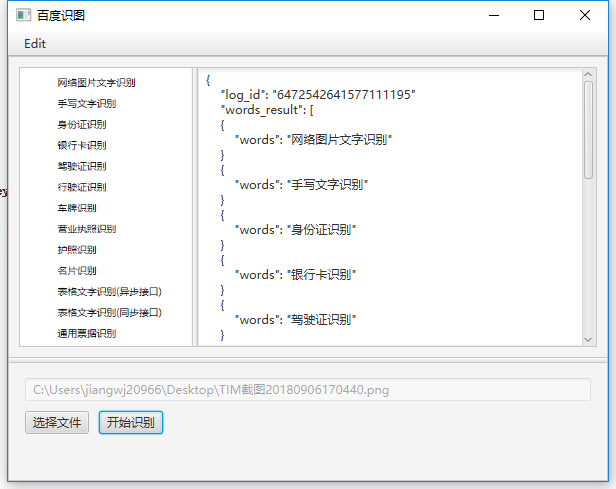
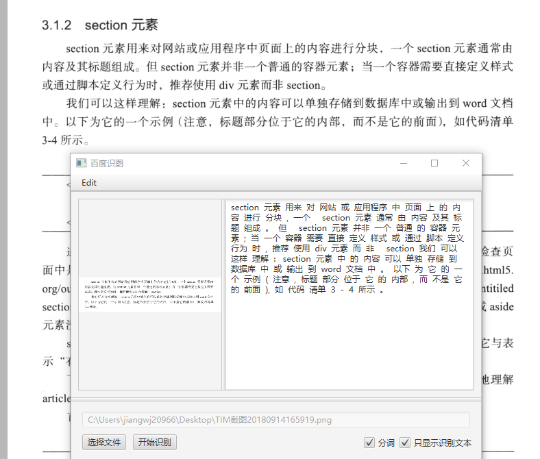
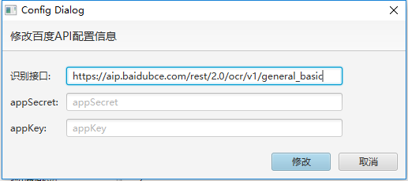

# 基于百度识图api的小工具

- 采用JavaFx开发的GUI界面
- 百度api文档见http://ai.baidu.com/docs#/OCR-API/e1bd77f3
- 选择图片文件后，单击左侧图片可以显示大图
- demo
- 
- 新增分词功能-基于结巴分词
- 
- 添加截图功能，可以直接截图然后识别
  - 截图相关源代码来自于 https://gitee.com/alanzyy/ScreenCapture.git 
## 注意事项
- 基于JDK8
- 首次使用前请前往百度开放平台申请app key和secret key, 每日50000次免费接口
- 申请后的key信息点击edit进行修改
- 